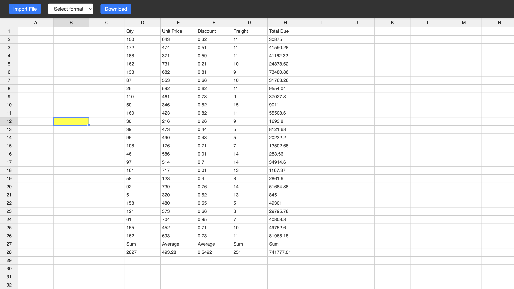
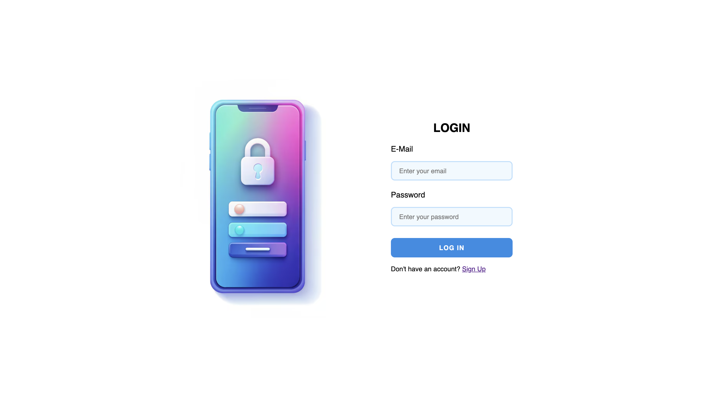
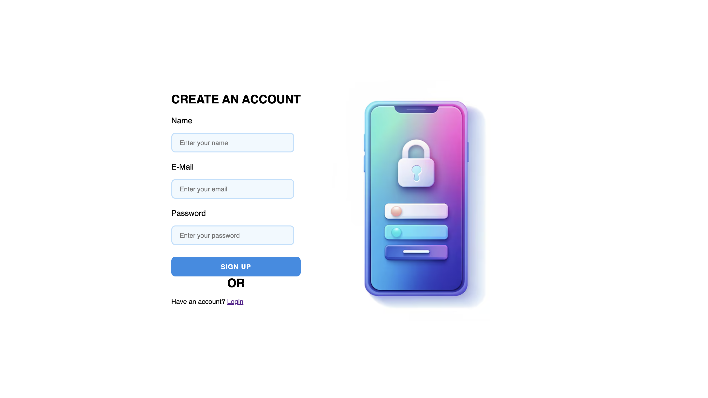

# SocialCalc, but modern
Made by the Mini Doras

## About The Project

This project is modernization of SocialCalc. It is a web-based application that provides an interactive spreadsheet experience directly in the browser. This project uses Node.js, Express, and React. It offers real-time collaboration, full spreadsheet functionality, version history management, and secure user authentication using JWT and bcrypt.

### Built With

* Express - [express.js](https://expressjs.com)
* Node JS - [node.js](https://nodejs.org/en/about)
* Socket.Io - [socket.io](https://socket.io/)
* React - [react.dev](https://react.dev/)
* Vite JS - [vitejs.dev](https://vitejs.dev/)
* Bcrypt - [bycrypt.js](https://www.npmjs.com/package/bcryptjs)
* JSON Web Tokens - [jwt.io](https://jwt.io/)
* Handsontable  - [handsontable.com](https://handsontable.com/)
* MongoDB - [MongoDB](https://www.mongodb.com/)

## Getting Started

### Prerequisites

This project requires the following npm packages:

#### Backend

- **[express](https://www.npmjs.com/package/express)**: Web framework for Node.js.
- **[socket.io](https://www.npmjs.com/package/socket.io)**: Socket.IO enables real-time bidirectional event-based communication
- **[jsonwebtoken](https://www.npmjs.com/package/jsonwebtoken)**: For creating and verifying JSON Web Tokens.
- **[bcrypt](https://www.npmjs.com/package/bcrypt)**: For hashing passwords.
- **[mongoose](https://www.npmjs.com/package/mongoose)**: MongoDB object modeling tool (if using MongoDB).
- **[cors](https://www.npmjs.com/package/cors)**: Middleware for enabling Cross-Origin Resource Sharing.
- **[dotenv](https://www.npmjs.com/package/dotenv)**: For managing environment variables.

#### Frontend

- **[react](https://www.npmjs.com/package/react)**: Frontend library for building user interfaces.
- **[react-dom](https://www.npmjs.com/package/react-dom)**: For DOM-related rendering.
- **[vite](https://www.npmjs.com/package/vite)**: Build tool for faster development.
  

### Installation

1. Clone the repo
   ```sh
   git clone https://github.com/HemantKr071/SocialCalc.git
   ```
2. Navigate to the `backend` directory and install NPM packages
   ```sh
   cd backend
   npm install
   ```
3. Start the backend server
    ```
      node index.js
    ```
4. Navigate to the `socialcalc` directory and install NPM packages
    ```
      cd ../socialcalc
      npm install
    ```
5. Start the frontend page
    ```
      npm run dev
    ```

## Screenshots





## License

Distributed under the MIT License. See `LICENSE.md` for more information.

